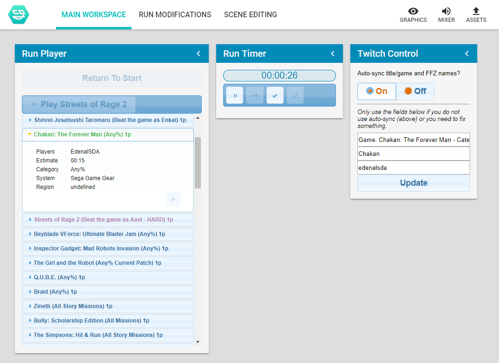

# nodecg-speedcontrol



*This is a bundle for [NodeCG](https://nodecg.com/); if you do not understand what that is, we advise you read their website first for more information.*

nodecg-speedcontrol, usually known as just "Speedcontrol", is a bundle for the [NodeCG](https://nodecg.com/) broadcast graphics framework/application developed for automating tasks for speedrunning marathons, mainly changing information on overlays and updating the Twitch information.

Some basic information:
- Import schedules from [Horaro](https://horaro.org/).
- By default, can store information on the run and the runners, but can also be customised to store more if needed by advanced users.
- Automatically change Twitch title and/or game directory if needed.
- Automatically feature the current runner(s) on the [FrankerFaceZ](https://www.frankerfacez.com/) featured channels function below the stream.
- Has an inbuilt timer (powered by [livesplit-core](https://github.com/LiveSplit/livesplit-core)); no need to have a seperate application open.
- Support for some donations trackers can be added with some extra bundles.

This bundle doesn't come with any graphics, you will need to create them yourself in another bundle. We currently have no READMEs for this but you can check out [speedcontrol-simpletext](https://github.com/speedcontrol/speedcontrol-simpletext) for an simple example bundle.

## Installation

You will need [Node.js](https://nodejs.org) (10.x LTS tested) and [git](https://git-scm.com/) installed to install NodeCG, then see the [NodeCG documentation](http://nodecg.com/) on how to install that. I also suggest installing `nodecg-cli`; information on that is also on the documentation just linked.

- `nodecg install speedcontrol/nodecg-speedcontrol` to install the latest version of nodecg-speedcontrol

This bundle can run without any extra configuration, but it's needed to use all of the functionality. Please see [Configuration.md](READMES/Configuration.md) for more information.

### tl;dr installation

Install [Node.js](https://nodejs.org) (10.x LTS tested) and [git](https://git-scm.com/), then make a folder anywhere and open a command prompt/shell/bash window, then run these commands in order:

```
npm install bower -g
npm install nodecg-cli -g
nodecg setup
nodecg install speedcontrol/nodecg-speedcontrol
nodecg start
```

## Where has this bundle been used before?

- All [European Speedrunner Assembly](https://www.esamarathon.com/) marathons starting from the Pre-ESA Marathon 2016, including the ESA ran Dreamhack speedrunning events in Sweden
- All [GTA Marathons](https://www.twitch.tv/gtamarathon) starting from GTA Marathon 2016
- [SpeedSouls Charity Marathon 2017 and 2018](https://www.twitch.tv/speedsouls)
- [Themeathon Pre-Marathon 2018](https://www.twitch.tv/themeathon)
- Several [Voltathon](https://www.twitch.tv/voltagegg) marathons
- Several [DegenDash](https://www.twitch.tv/degendash) marathons
- Some marathons on [The Fast Force](https://www.twitch.tv/thefastforce) Twitch channel
- [A Race Against Time 3](https://www.twitch.tv/araceagainsttime) marathon
- [Power Up With Pride: Winter Pride 2018](https://www.twitch.tv/powerupwithpride) marathon

## Authors/Contributors

Originally developed by Charleon, now mainly developed by zoton2.

With help from:
- btrim
- Zephyyrr
- Planks